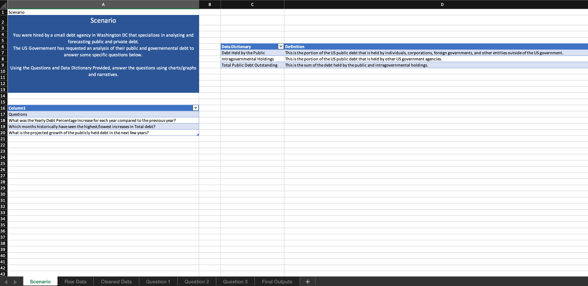

# 💰 US Debt Tracker (Excel Project)

## 📊 Project Overview

This project analyses U.S. national debt data using Microsoft Excel.  
It explores how U.S. federal debt has evolved over time, identifies patterns and growth trends, and provides short-term forecasts of future debt levels.

The project demonstrates strong Excel and data analysis skills in:
- Data cleaning and preparation (handling formatting issues and missing values)
- Exploratory analysis using formulas, pivot tables, and visualisations
- Forecasting future debt using built-in Excel time-series tools
- Data storytelling — turning raw data into clear insights about economic trends

---

## 🔧 Project Structure
- **Scenario.xlsx** → Context, objectives, and analytical questions guiding the project  
- **Raw Data.xlsx** → Unprocessed dataset containing U.S. debt figures over time  
- **Cleaned Data.xlsx** → Cleaned version of the dataset, ready for analysis  
- **Question 1.xlsx** → Identifying debt growth trends over the years  
- **Question 2.xlsx** → Comparing monthly debt changes and identifying peaks/lows  
- **Question 3.xlsx** → Forecasting U.S. debt from 2024–2027 using Excel’s FORECAST.ETS function  
- **Final Outputs.xlsx** → Combined summary visualising total debt, trends, and future projections  

---

## ❓ Key Questions & Findings

### 1️⃣ Scenario and Project Context
The project simulates working for the U.S. Department of the Treasury, tasked with analysing national debt trends and forecasting future debt levels.  
The goal was to provide a clear view of how U.S. debt has grown, identify yearly changes, and produce visual forecasts to support policymaking.  

📂 File: `Scenario.xlsx`  
📸 Screenshot:  

---

### 2️⃣ Raw Data – The Starting Point
The raw dataset contained U.S. debt figures (in billions) listed chronologically. However, it suffered from:
- Inconsistent number formatting (some using commas, others not)  
- Blank or missing entries for certain months  
- Mixed date formats (e.g., “01/2020” vs “2020”)  

Before cleaning, this data could not be effectively analysed or charted.  

📂 File: `Raw Data.xlsx`  
📸 Screenshot:  

---

### 3️⃣ Cleaned Data – Preparing for Analysis
Data cleaning involved:
- Standardising date formats into a consistent “YYYY” structure  
- Converting all numeric values into uniform number formats  
- Removing duplicates and fixing gaps in the debt figures  
- Creating a structured table suitable for formulas and pivot tables  

The cleaned dataset allowed clear trend analysis and forecasting to be performed accurately.  

📂 File: `Cleaned Data.xlsx`  
📸 Screenshot:  

---

### 4️⃣ Question 1 – How has U.S. national debt changed over time?
The first analytical step visualised total U.S. debt by year.  

**Key findings included:**
- A steady upward trend in total debt across the recorded period  
- Notable accelerations in debt growth around major events such as the 2008 financial crisis and the 2020 pandemic  
- The average annual increase in total U.S. debt showed a consistent upward slope, confirming sustained fiscal expansion  

📂 File: `Question 1.xlsx`  
📸 Screenshot:  

---

### 5️⃣ Question 2 – Which months historically have seen the highest or lowest increases in total debt?

This analysis examined **monthly fluctuations in total U.S. debt** to identify when borrowing tends to surge or stabilise.  
Using Excel formulas, a new column calculated:  
**Monthly Change = Current Month Debt – Previous Month Debt**, revealing patterns in how debt evolves across the year.  

**Findings showed:**
- The **highest debt increases** historically occurred during **January, February, November, and December**.  
- The **lowest increases** were observed during **April, May, June, and July**.  
- These trends suggest a clear **seasonal pattern** in government borrowing and public spending.  

**Interpretation:**  
The high-debt months coincide with major U.S. holidays such as **Thanksgiving and Christmas**, when spending and economic activity typically surge.  
Conversely, the lower-debt months align with the **summer period**, when fewer national events occur and borrowing demand is reduced.  

📂 File: `Question 2.xlsx`  
📸 Screenshot:  

---

### 6️⃣ Question 3 – What will U.S. debt look like in the next few years?
In the final analytical stage, Excel’s **FORECAST.ETS** function was used to project U.S. debt from 2024 to 2027.  
This time-series function predicts future values based on historical data, considering patterns and trends.  

**Steps included:**
- Selecting the historical years as the timeline array  
- Choosing total debt as the known values array  
- Setting the forecast period to 2024–2027  
- Visualising the results through a line chart combining historical and forecasted values  

**Findings showed:**
- The model predicts a continued upward trajectory in debt levels  
- Forecasts indicate potential total debt surpassing all previous peaks  
- The projection reinforces long-term sustainability concerns if growth continues unchecked  

📂 File: `Question 3.xlsx`  
📸 Screenshot:  

---

### 7️⃣ Final Outputs – Summary Dashboard
All findings were consolidated into a visual summary dashboard showing:
- Historical trend lines  
- Year-on-year changes  
- Forecasted debt figures (2024–2027)  

This provided a complete overview of how U.S. debt evolved, what drove changes, and where it might head next.  

📂 File: `Final Outputs.xlsx`  
📸 Screenshot:  

---

## 🚀 Key Insights
- U.S. national debt continues to rise steadily, driven by borrowing and recurring fiscal deficits  
- Major events like recessions and pandemics cause pronounced spikes in debt accumulation  
- Forecasting confirms the trend will likely continue upward over the next several years  
- Excel’s analytical tools enable effective data-driven storytelling for economic policy  

---

## 🛠️ Tools Used
- **Microsoft Excel** – data cleaning, analysis, pivot tables, and forecasting  
- **FORECAST.ETS** – time-series debt projection  
- **GitHub** – version control, portfolio presentation, and documentation  

---

## 📌 How to Use
1. Clone this repository or download the files  
2. Open `.xlsx` files in Microsoft Excel  
3. Review in sequence: **Scenario → Raw → Cleaned → Q1–Q3 → Final Outputs**  
4. View the `/screenshots` folder for quick visual summaries  

---

✍️ *This project is part of my data analysis portfolio, showcasing Excel-based time-series analysis, data cleaning, and forecasting using real-world economic data.*
